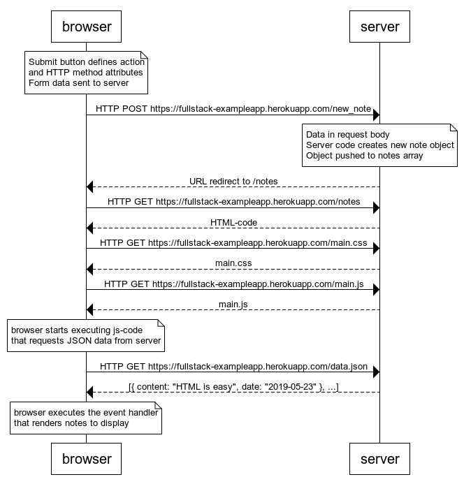
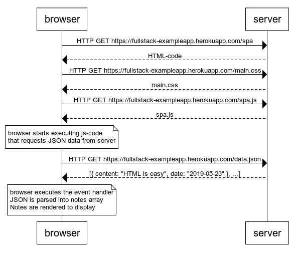
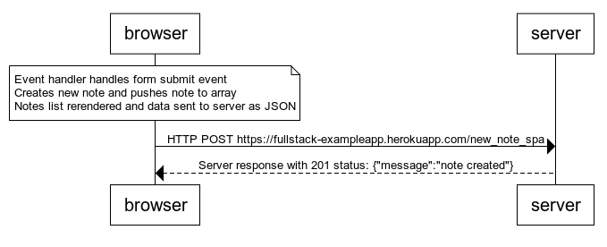

Diagrams created with https://www.websequencediagrams.com/

## Traditional Web App Sequence Diagram

### 0.4 new note 
User creates new note on traditional web app - https://fullstack-exampleapp.herokuapp.com/notes 

```
note over browser: 
Submit button defines action
and HTTP method attributes
Form data sent to server
end note

browser->server: HTTP POST https://fullstack-exampleapp.herokuapp.com/new_note

note over server:
Data in request body
Server code creates new note object
Object pushed to notes array
end note

server-->browser: URL redirect to /notes
browser->server: HTTP GET https://fullstack-exampleapp.herokuapp.com/notes
server-->browser: HTML-code
browser->server: HTTP GET https://fullstack-exampleapp.herokuapp.com/main.css
server-->browser: main.css
browser->server: HTTP GET https://fullstack-exampleapp.herokuapp.com/main.js
server-->browser: main.js

note over browser:
browser starts executing js-code
that requests JSON data from server 
end note

browser->server: HTTP GET https://fullstack-exampleapp.herokuapp.com/data.json
server-->browser: [{ content: "HTML is easy", date: "2019-05-23" }, ...]

note over browser:
browser executes the event handler
that renders notes to display
end note
```



## Single Page App Sequence Diagrams

### 0.5 Single page app
Chain of events from opening https://fullstack-exampleapp.herokuapp.com/spa
```
browser->server: HTTP GET https://fullstack-exampleapp.herokuapp.com/spa
server-->browser: HTML-code
browser->server: HTTP GET https://fullstack-exampleapp.herokuapp.com/main.css
server-->browser: main.css
browser->server: HTTP GET https://fullstack-exampleapp.herokuapp.com/spa.js
server-->browser: spa.js

note over browser:
browser starts executing js-code
that requests JSON data from server 
end note

browser->server: HTTP GET https://fullstack-exampleapp.herokuapp.com/data.json
server-->browser: [{ content: "HTML is easy", date: "2019-05-23" }, ...]

note over browser:
browser executes the event handler
JSON is parsed into notes array
Notes are rendered to display 
end note
```



### 0.6 New note
User creates note on SPA - https://fullstack-exampleapp.herokuapp.com/spa

```
note over browser: 
Event handler handles form submit event
Creates new note and pushes note to array
Notes list rerendered and data sent to server as JSON
end note

browser->server: HTTP POST https://fullstack-exampleapp.herokuapp.com/new_note_spa
server-->browser: Server response with 201 status: {"message":"note created"}
```

